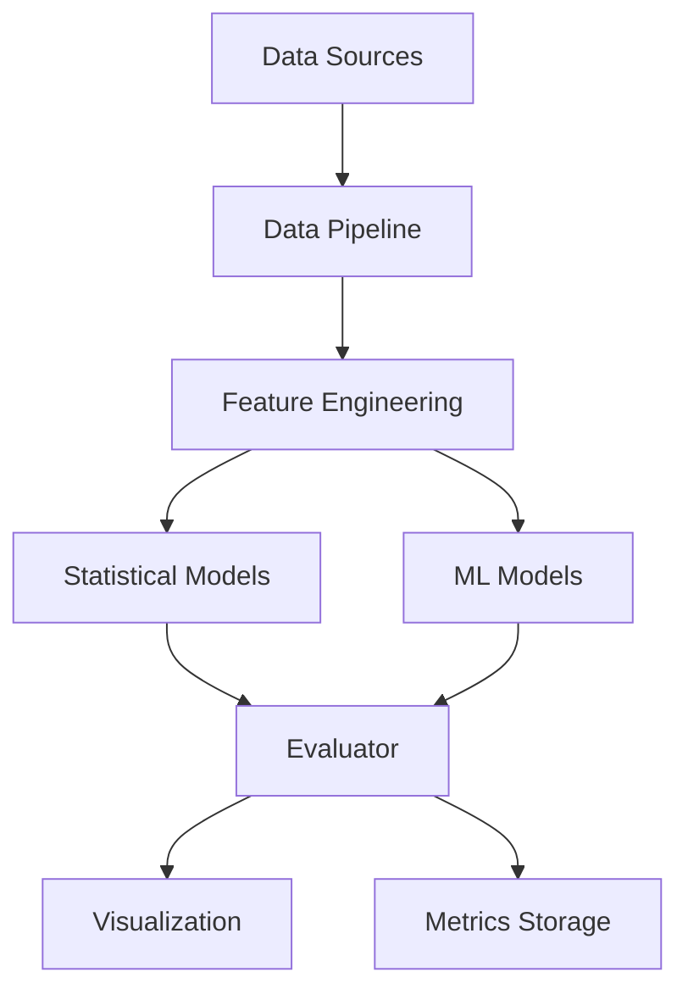

# Design Document: Insulin Response Modeling System

## Overview

The insulin response modeling system is a Python-based data science platform that analyzes and predicts blood glucose responses after meals. The system processes two distinct data tracks: tabular snapshots (Track A) and continuous time-series data (Track B), applying both statistical and machine learning models to understand glucose dynamics across different health populations.

The system follows a modular architecture with clear separation between data processing, model training, and evaluation components. It supports multiple modeling approaches ranging from simple linear regression to advanced deep learning architectures, enabling comprehensive comparison of prediction strategies.

## Architecture

The system follows a pipeline architecture with four main stages:

```
Data Acquisition → Feature Engineering → Model Training → Evaluation & Visualization
```

### High-Level Component Diagram



### Component Responsibilities

1. **Data Pipeline**: Downloads, parses, and validates raw datasets
2. **Feature Engineering**: Transforms raw data into model-ready features
3. **Statistical Models**: Implements baseline regression and time-series models
4. **ML Models**: Implements tree-based, SVM, and deep learning models
5. **Evaluator**: Performs cross-validation, computes metrics, and generates visualizations
6. **Visualization**: Creates plots for EDA and model performance analysis

## Components and Interfaces

### 1. Data Pipeline (`src/insulin_response/data_preprocessing.py`)

**Purpose**: Acquire and preprocess datasets for both Track A and Track B.

**Key Classes**:

```python
class DatasetLoader:
    """Base class for dataset loading"""
    def download() -> bool
    def validate() -> bool
    def load() -> pd.DataFrame

class UCIDiabetesLoader(DatasetLoader):
    """Loads UCI Diabetes dataset (Track A)"""
    def download() -> bool
    def parse() -> pd.DataFrame
    # Returns: DataFrame with columns [pre_meal_glucose, post_meal_glucose, 
    #          insulin_dose, meal_timestamp] plus the derived
    #          *_out_of_range flags for each glucose column

class CGMacrosLoader(DatasetLoader):
    """Loads CGMacros dataset (Track B)"""
    def download() -> bool
    def parse_participant(participant_id: int) -> pd.DataFrame
    def exclude_dropouts() -> List[int]
    # Returns: DataFrame with columns [participant_id, timestamp, glucose, 
    #          carbs, fat, protein, activity, heart_rate, health_group] plus the
    #          derived glucose_out_of_range flag. Rows are sorted by timestamp
    #          within each participant so downstream time-series splits cannot
    #          train on future readings.

class FeatureEngineer:
    """Transforms raw data into model features"""
    def calculate_time_since_meal(df: pd.DataFrame) -> pd.DataFrame
    def extract_macronutrients(df: pd.DataFrame) -> pd.DataFrame
    def compute_baseline_glucose(df: pd.DataFrame) -> pd.DataFrame
    def encode_health_group(df: pd.DataFrame) -> pd.DataFrame
    def validate_features(df: pd.DataFrame) -> bool
```

**Data Validation Rules**:
- Glucose values must be in range [20, 600] mg/dL
- Timestamps must be monotonically increasing within participants
- Required columns must be present (raises ValueError if missing)
- Participants 24, 25, 37, 40 must be excluded from CGMacros data

### 2. Statistical Models (`src/insulin_response/statistical_models.py`)

**Purpose**: Implement baseline statistical models for both tracks.

**Key Classes**:

```python
class BaselineModel:
    """Abstract base class for statistical models"""
    def fit(X: pd.DataFrame, y: pd.Series) -> None
    def predict(X: pd.DataFrame) -> np.ndarray
    def get_params() -> dict

class LinearRegressionModel(BaselineModel):
    """Linear regression for Track A"""
    def __init__()
    def fit(X: pd.DataFrame, y: pd.Series) -> None
    def predict(X: pd.DataFrame) -> np.ndarray
    # Predicts: post_meal_glucose_rise from pre_meal_glucose, 
    #           insulin_dose, macronutrients

class ARIMAModel(BaselineModel):
    """ARIMA/SARIMAX for Track B time-series"""
    def __init__(order: Tuple[int, int, int])
    def fit(X: pd.DataFrame, y: pd.Series) -> None
    def predict(steps: int) -> np.ndarray
    # Predicts: next N glucose values from historical CGM readings
```

### 3. ML Models (`src/insulin_response/ml_models.py`)

**Purpose**: Implement machine learning models for both tracks.

**Key Classes**:

```python
class MLModel:
    """Abstract base class for ML models"""
    def fit(X: pd.DataFrame, y: pd.Series) -> None
    def predict(X: pd.DataFrame) -> np.ndarray
    def get_hyperparams() -> dict
    def set_hyperparams(params: dict) -> None

class RandomForestModel(MLModel):
    """Random Forest for Track A"""
    def __init__(n_estimators: int = 100, max_depth: int = None)

class SVMModel(MLModel):
    """Support Vector Machine for Track A"""
    def __init__(kernel: str = 'rbf', C: float = 1.0)

class XGBoostModel(MLModel):
    """XGBoost for Track A"""
    def __init__(n_estimators: int = 100, learning_rate: float = 0.1)

class LightGBMModel(MLModel):
    """LightGBM for Track A"""
    def __init__(n_estimators: int = 100, learning_rate: float = 0.1)

class LSTMModel(MLModel):
    """LSTM for Track B time-series"""
    def __init__(hidden_size: int = 64, num_layers: int = 2)
    def fit(X: np.ndarray, y: np.ndarray, epochs: int = 50) -> None
    # Input shape: (batch, sequence_length, features)
    # Output shape: (batch, prediction_horizon)

class TransformerModel(MLModel):
    """Transformer for Track B time-series"""
    def __init__(d_model: int = 64, nhead: int = 4, num_layers: int = 2)
    def fit(X: np.ndarray, y: np.ndarray, epochs: int = 50) -> None
    # Input shape: (batch, sequence_length, features)
    # Output shape: (batch, prediction_horizon)
```

### 4. Evaluator (`src/insulin_response/evaluate.py`)

**Purpose**: Evaluate models using cross-validation and compute performance metrics.

**Key Classes**:

```python
class ModelEvaluator:
    """Evaluates models and computes metrics"""
    def cross_validate_track_a(model: MLModel, X: pd.DataFrame, 
                                y: pd.Series, k: int = 5) -> dict
    def cross_validate_track_b(model: MLModel, X: pd.DataFrame, 
                                y: pd.Series, n_splits: int = 5) -> dict
    def compute_metrics(y_true: np.ndarray, y_pred: np.ndarray) -> dict
    # Returns: {'rmse': float, 'mae': float, 'r2': float, 'mape': float}

class HyperparameterTuner:
    """Optimizes model hyperparameters"""
    def grid_search(model: MLModel, param_grid: dict, X: pd.DataFrame, 
                    y: pd.Series, cv: int = 5) -> dict
    def random_search(model: MLModel, param_distributions: dict, 
                      X: pd.DataFrame, y: pd.Series, 
                      n_iter: int = 50, cv: int = 5) -> dict
    # Returns: best_params dict

class Visualizer:
    """Creates evaluation visualizations"""
    def plot_metric_comparison(results: dict, output_path: str) -> None
    def plot_predicted_vs_actual(y_true: np.ndarray, y_pred: np.ndarray, 
                                  model_name: str, output_path: str) -> None
    def plot_residuals(y_true: np.ndarray, y_pred: np.ndarray, 
                       model_name: str, output_path: str) -> None
    def plot_glucose_curves(df: pd.DataFrame, output_path: str) -> None
```

## Data Models

### Track A Data Schema

```python
TrackARecord = {
    'pre_meal_glucose': float,      # mg/dL, range [20, 600]
    'post_meal_glucose': float,     # mg/dL, range [20, 600]
    'pre_meal_glucose_out_of_range': bool,   # derived by the loader; True when the
                                             # reading falls outside [20, 600]
    'post_meal_glucose_out_of_range': bool,  # derived by the loader
    'glucose_rise': float,          # mg/dL, computed as post - pre
    'insulin_dose': float,          # units
    'meal_timestamp': datetime,
    'carbs': float,                 # grams
    'fat': float,                   # grams
    'protein': float,               # grams
    'health_group': str             # 'healthy', 'pre-diabetic', 't2d'
}
```

### Track B Data Schema

```python
TrackBRecord = {
    'participant_id': int,          # original CGMacros IDs 1-49, excluding
                                    # dropouts [24, 25, 37, 40] -> 45 participants
    'timestamp': datetime,
    'glucose': float,               # mg/dL from CGM, range [20, 600]
    'glucose_out_of_range': bool,   # derived by the loader; True when the reading
                                    # falls outside [20, 600]
    'carbs': float,                 # grams
    'fat': float,                   # grams
    'protein': float,               # grams
    'activity': float,              # activity level
    'heart_rate': float,            # bpm
    'health_group': str,            # 'healthy', 'pre-diabetic', 't2d'
    'time_since_meal': float,       # minutes, computed feature
    'baseline_glucose': float       # mg/dL, computed feature
}
```

### Model Results Schema

```python
ModelResult = {
    'model_name': str,
    'track': str,                   # 'A' or 'B'
    'metrics': {
        'rmse': float,
        'mae': float,
        'r2': float,
        'mape': float
    },
    'hyperparams': dict,
    'cv_scores': List[float],
    'converged': bool,              # False if training hit a convergence failure;
                                    # must be surfaced in any cross-model comparison
    'training_time': float,         # seconds
    'predictions': np.ndarray,
    'actuals': np.ndarray
}
```


## Correctness Properties

A property is a characteristic or behavior that should hold true across all valid executions of a system—essentially, a formal statement about what the system should do. Properties serve as the bridge between human-readable specifications and machine-verifiable correctness guarantees.

### Property Reflection

After analyzing all acceptance criteria, I identified several areas of redundancy:

1. **Data extraction properties (1.2, 1.4, 2.2, 2.4)** can be consolidated into a single comprehensive property about field extraction
2. **Metric calculation properties (6.3, 6.4, 6.5, 6.6)** are all testing the same pattern - correct metric computation - and can be combined
3. **Model training properties (5.1-5.6)** all follow the same pattern and can be consolidated
4. **Data leakage properties (4.3, 5.7, 6.7)** are testing the same underlying concern about train/test separation
5. **Outlier detection (3.5) and error handling (10.3)** are testing the same functionality

The following properties represent the unique, non-redundant validation requirements:

### Property 1: Complete Field Extraction

*For any* dataset (Track A or Track B), when the Data Pipeline processes it, all required fields specified for that track must be present in the output DataFrame.

**Validates: Requirements 1.2, 1.4, 2.2, 2.4**

### Property 2: Health Group Categorization

*For any* participant in the CGMacros dataset, the system must assign exactly one valid health group from the set {'healthy', 'pre-diabetic', 't2d'}.

**Validates: Requirements 1.6**

### Property 3: Time-Since-Meal Calculation

*For any* meal event and subsequent glucose measurement, the calculated time-since-meal must equal the difference between the glucose measurement timestamp and the meal timestamp.

**Validates: Requirements 2.1**

### Property 4: Baseline Glucose Computation

*For any* participant with glucose measurements, the system must compute a baseline glucose value that is within the range of that participant's measurements.

**Validates: Requirements 2.3**

### Property 5: Health Group Encoding

*For any* health group string value, the encoding function must produce a consistent categorical representation that can be reversed to recover the original string.

**Validates: Requirements 2.5**

### Property 6: Feature Validation

*For any* engineered feature set, the validation function must correctly identify when required features are missing or when values fall outside expected ranges.

**Validates: Requirements 2.6**

### Property 7: Missing Data Calculation

*For any* dataset with known missing values, the calculated missing data percentage for each feature must equal (count of missing values / total rows) × 100.

**Validates: Requirements 3.4**

### Property 8: Outlier Detection

*For any* non-missing glucose measurement, the system must flag it as an outlier if and only if the value is less than 20 mg/dL or greater than 600 mg/dL. Missing (NaN) values are never flagged as outliers; they are accounted for by the missing-data audit (Property 7).

**Validates: Requirements 3.5, 3.7, 10.3**

### Property 9: Train-Test Separation

*For any* model training process, the indices of training data and test data must be disjoint (no overlap).

**Validates: Requirements 4.3, 5.7, 6.7**

### Property 10: Model Parameter Storage

*For any* trained statistical or ML model, the system must store model parameters such that they can be retrieved and used to reconstruct the model's predictions.

**Validates: Requirements 4.4**

### Property 11: Model Training and Prediction

*For any* implemented model (Linear Regression, ARIMA, Random Forest, SVM, XGBoost, LightGBM, LSTM, Transformer) and valid input data, the model must successfully train and produce predictions with the same number of samples as the input.

**Validates: Requirements 4.1, 4.2, 5.1, 5.2, 5.3, 5.4, 5.5, 5.6**

### Property 12: Temporal Ordering in Time-Series Splits

*For any* time-series data split, and *for any* participant appearing in both the training and test sets, all of that participant's test-set timestamps must be strictly greater than all of that participant's training-set timestamps.

Note: the ordering constraint is scoped **per participant**, not globally. Participants were recorded over overlapping and differing calendar windows, so a methodologically correct per-participant temporal split will routinely place one participant's held-out tail earlier in calendar time than another participant's training data. A global timestamp ordering requirement would reject correct implementations.

**Validates: Requirements 6.2**

### Property 13: Cross-Validation Fold Count

*For any* Track A model evaluation, the number of cross-validation folds must be greater than or equal to 5.

**Validates: Requirements 6.1**

### Property 14: Metric Calculation Correctness

*For any* set of predictions and actual values, the computed metrics (RMSE, MAE, R², MAPE) must match the standard mathematical definitions of these metrics.

**Validates: Requirements 6.3, 6.4, 6.5, 6.6**

### Property 15: Hyperparameter Search Execution

*For any* ML model and parameter grid, the hyperparameter search must complete and return a dictionary of best parameters such that (a) every returned parameter value is drawn from the supplied search space, and (b) the best candidate's cross-validated score is greater than or equal to the cross-validated score of every other candidate evaluated in the same search.

Note: this property deliberately does **not** assert that tuned parameters beat default parameters. That only holds if the defaults are themselves in the search space *and* both are scored on identical folds; measured on held-out test data, tuning can legitimately underperform defaults. Asserting otherwise would produce a flaky test. Requirement 7.4's improvement-over-defaults figure is a logged diagnostic, not an invariant.

**Validates: Requirements 7.1, 7.3, 7.4**

### Property 16: Cross-Validation in Hyperparameter Search

*For any* hyperparameter search over a search space of size N with cv=k, the returned search results must contain per-candidate cross-validation records covering all N candidates, each with k fold scores.

Note: the original phrasing ("cross-validation must be used to evaluate each parameter combination") asserted an implementation detail that is not observable from the search's outputs. This restatement expresses the same intent as an observable postcondition on the returned `cv_results_` structure, and is verifiable as a structural assertion.

**Validates: Requirements 7.2**

### Property 17: Visualization File Storage

*For any* generated visualization, the system must save the file to the designated output directory with a filename that includes the visualization type and model name.

**Validates: Requirements 8.5**

### Property 18: Dependency Verification

*For any* required package in the dependencies list, the verification function must correctly identify whether the package is installed and importable.

**Validates: Requirements 9.5**

### Property 19: Missing Column Error Reporting

*For any* dataset with missing required columns, the parsing function must raise an error that lists all missing column names.

**Validates: Requirements 10.2**

### Property 20: Dropout Participant Exclusion

*For any* CGMacros dataset directory, regardless of which participant files are present, no record in the loaded output may have a `participant_id` in {24, 25, 37, 40}.

**Validates: Requirements 1.5**

## Error Handling

The system implements defensive error handling at multiple levels:

### Data Loading Errors

- **Missing Files**: Raise `FileNotFoundError` with path information
- **Corrupted Files**: Raise `ValueError` with file name and corruption details

Note: the system performs no network I/O. Both `download()` methods raise `NotImplementedError` by design — the loaders consume a normalized, pre-processed on-disk schema. Network retry/backoff handling is therefore deliberately absent, and must not be added until a real `download()` implementation is in scope.

### Data Validation Errors

- **Missing Columns**: Raise `ValueError` listing all missing columns
- **Out-of-Range Values**: Log warning with row index and value, flag data point, continue processing
- **Invalid Timestamps**: Raise `ValueError` with row index and timestamp value
- **Type Mismatches**: Raise `TypeError` with expected and actual types

### Model Training Errors

- **Insufficient Data**: Raise `ValueError` with minimum data requirements (e.g., "Minimum 100 samples required, got 50")
- **Convergence Failures**: Log warning and record a `converged: False` field on the model's `ModelResult`. A non-converged model MUST NOT be reported in a cross-model comparison without that status being surfaced alongside its metrics — a silently degraded model entering a benchmark table is the failure mode `.kiro/steering/defensive-coding.md` exists to prevent.
- **NaN/Inf in Predictions**: Raise `RuntimeError` with diagnostic information about input data statistics

### Fallback Strategies

- **CGMacros Unavailable**: Log an error naming the expected path and the required layout, then raise `FileNotFoundError`. Per `.kiro/steering/defensive-coding.md` the loader fails loudly rather than continuing with no data; "do not crash" is not the contract. An absent dataset is an unrecoverable precondition failure, not a degraded mode.
- **Visualization Failures**: Log error, continue with other visualizations

Note: no hyperparameter-search timeout is specified in Requirement 7, so none is implemented. If a timeout is added later it needs an acceptance criterion first — returning "best parameters found so far" from a truncated search silently changes what the reported result means.

## Testing Strategy

The system employs a dual testing approach combining unit tests and property-based tests for comprehensive coverage.

### Unit Testing

Unit tests focus on:
- **Specific examples**: Test known input-output pairs (e.g., specific meal with known glucose response)
- **Edge cases**: Empty datasets, single-row datasets, boundary values
- **Error conditions**: Missing files, corrupted data, invalid inputs
- **Integration points**: Data pipeline → feature engineering → model training flow

Example unit tests:
- Test that UCI Diabetes loader correctly parses a sample CSV file
- Test that dropout participants (24, 25, 37, 40) are excluded
- Test that visualization functions create files in the correct directory
- Test that RMSE calculation matches expected value for known predictions

### Property-Based Testing

Property tests verify universal properties across randomized inputs using a property-based testing library (Hypothesis for Python).

**Configuration**:
- Minimum 100 iterations per property test
- Each test tagged with: `# Feature: insulin-response-modeling, Property N: [property text]`
- Use appropriate generators for domain-specific data (glucose values in [20, 600], valid timestamps, etc.)

**Property Test Examples**:

```python
# Feature: insulin-response-modeling, Property 1: Complete Field Extraction
@given(track_a_data=track_a_dataframe_generator())
def test_track_a_field_extraction(track_a_data):
    result = data_pipeline.process_track_a(track_a_data)
    required_fields = ['pre_meal_glucose', 'post_meal_glucose', 
                       'insulin_dose', 'meal_timestamp']
    assert all(field in result.columns for field in required_fields)

# Feature: insulin-response-modeling, Property 8: Outlier Detection
@given(glucose=st.floats(min_value=-100, max_value=800))
def test_outlier_detection(glucose):
    is_outlier = detect_outlier(glucose)
    expected = (glucose < 20) or (glucose > 600)
    assert is_outlier == expected

# Feature: insulin-response-modeling, Property 14: Metric Calculation Correctness
@given(y_true=st.lists(st.floats(min_value=20, max_value=600), min_size=10),
       y_pred=st.lists(st.floats(min_value=20, max_value=600), min_size=10))
def test_rmse_calculation(y_true, y_pred):
    assume(len(y_true) == len(y_pred))
    calculated_rmse = compute_metrics(y_true, y_pred)['rmse']
    expected_rmse = np.sqrt(np.mean((np.array(y_true) - np.array(y_pred))**2))
    assert np.isclose(calculated_rmse, expected_rmse)
```

### Testing Balance

- Property tests handle comprehensive input coverage through randomization
- Unit tests focus on specific scenarios and integration
- Both are necessary: unit tests catch concrete bugs, property tests verify general correctness
- Avoid writing too many unit tests for cases already covered by properties

### Test Organization

```
tests/
├── unit/
│   ├── test_data_loading.py
│   ├── test_feature_engineering.py
│   ├── test_models.py
│   └── test_evaluation.py
├── property/
│   ├── test_data_properties.py
│   ├── test_model_properties.py
│   └── test_evaluation_properties.py
└── integration/
    └── test_end_to_end.py
```

### Continuous Integration

- Run all tests on every commit
- Property tests run with 100 iterations in CI, 1000 iterations nightly
- Code coverage target: 85% for core modules
- Performance benchmarks: Track model training time and prediction latency
